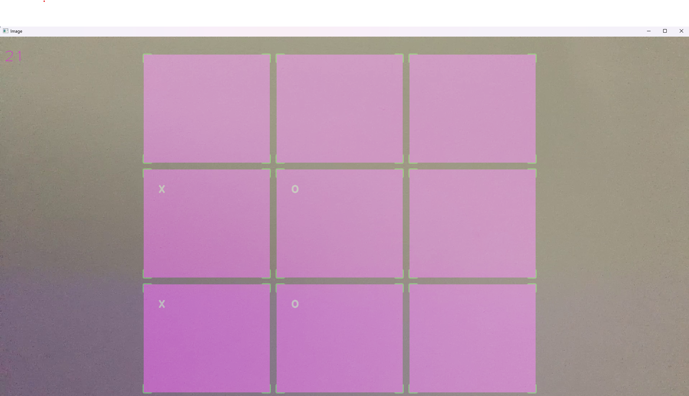
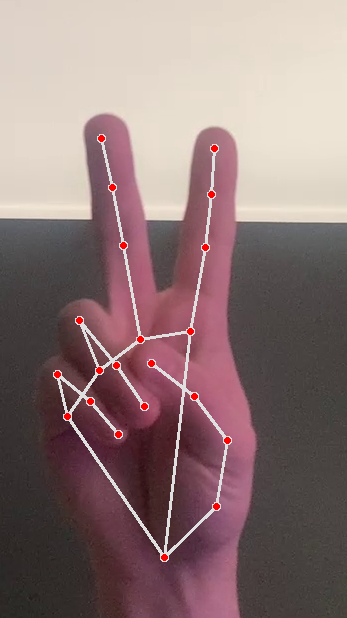
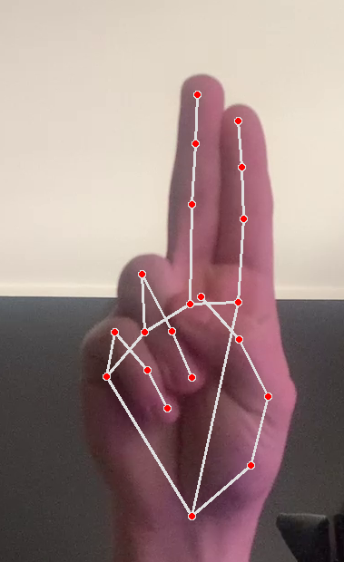

# Virtual Tic tac toe
## The program runs in python 3.8.10
### The program displays a tic-tac-toe game board on the camcorder image. 

### Bringing two fingers together means checking the box 

### A simple tic-tac-toe script is responsible for the game